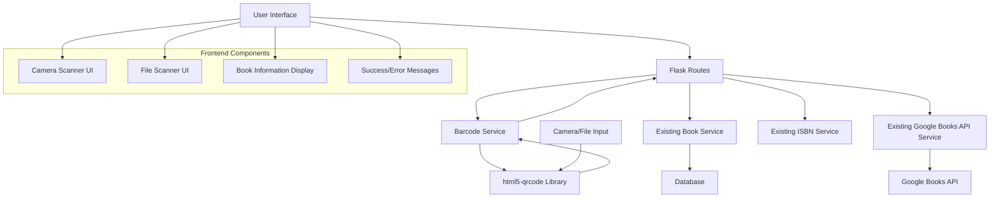

# Design Document: Barcode Scanning Feature

## Overview

This document outlines the design for integrating barcode scanning capabilities into the existing Flask-based book management application. The feature will enable users to scan book barcodes using their device camera or by uploading image files, automatically retrieve book information from the Google Books API, and save books to their collection.

The design leverages the **html5-qrcode JavaScript library** for barcode detection as the primary implementation approach. While there are plans to migrate to the native **Barcode Detection API** in the future, this migration is currently postponed due to HTTPS requirements and limited browser support. The current implementation prioritizes immediate feature delivery using the proven html5-qrcode library.

The design maintains consistency with the existing application architecture, including the service layer pattern, progressive enhancement with htmx, and graceful error handling.

## Architecture

### High-Level Architecture



### Integration Points

The barcode scanning feature integrates with existing system components:

1. **Existing Services**: Reuses `book_service.py`, `google_books_api.py`, and `isbn_service.py`
2. **Database Layer**: Uses existing Book model and database operations
3. **UI Framework**: Follows existing htmx patterns for progressive enhancement
4. **Error Handling**: Leverages existing error handling patterns and fallback mechanisms

## Components and Interfaces

### 1. Barcode Service (`app/services/barcode_service.py`)

**Purpose**: Orchestrates the barcode scanning workflow and integrates with existing services.

**Key Functions**:
```python
def process_scanned_barcode(
    scanned_text: str, 
    scan_type: str
) -> Tuple[Optional[Book], Optional[str], bool]:
    """
    Process a scanned barcode result and create book record.
    
    Args:
        scanned_text: The text extracted from barcode
        scan_type: 'camera' or 'file' for tracking purposes
    
    Returns:
        Tuple of (book_object, error_message, should_retry_later)
    """

def validate_barcode_result(scanned_text: str) -> Tuple[bool, Optional[str]]:
    """
    Validate that scanned text is a valid ISBN.
    
    Returns:
        Tuple of (is_valid, error_message)
    """
```

### 2. Flask Routes (`app/routes.py` - additions)

**New Routes**:

```python
@main.route("/scan")
def barcode_scanner():
    """Display barcode scanning interface."""

@main.route("/scan/process", methods=["POST"])
def process_barcode_scan():
    """Process scanned barcode and return book information."""

@main.route("/scan/save", methods=["POST"])
def save_scanned_book():
    """Save confirmed book to database."""
```

### 3. Frontend Components

#### Camera Scanner Component
- **File**: `app/static/js/barcode-scanner.js`
- **Purpose**: Manages html5-qrcode library integration
- **Key Features**:
  - Camera initialization and permission handling
  - Barcode detection and result processing
  - Error handling and user feedback
  - Integration with htmx for server communication

#### Scanner UI Templates
- **Scanner Page**: `app/templates/barcode_scanner.html`
- **Book Confirmation**: `app/templates/fragments/scanned_book_confirmation.html`
- **Scanner Fragments**: `app/templates/fragments/scanner_*.html`

## Data Models

### Existing Book Model
The feature reuses the existing `Book` model without modifications. All barcode-scanned books follow the same data structure and validation rules.

### Scanning Session Data
Temporary data structure for managing scanning sessions (not persisted):

```python
@dataclass
class ScanningSession:
    """Temporary data structure for scanning workflow."""
    scanned_isbn: str
    scan_type: str  # 'camera' or 'file'
    book_metadata: Optional[Dict[str, Any]]
    timestamp: datetime
    session_id: str
```

## Correctness Properties

*A property is a characteristic or behavior that should hold true across all valid executions of a system-essentially, a formal statement about what the system should do. Properties serve as the bridge between human-readable specifications and machine-verifiable correctness guarantees.*

Based on the prework analysis of acceptance criteria, the following properties ensure the barcode scanning feature operates correctly:

### Property 1: Barcode Extraction Consistency
*For any* valid barcode image (camera or file), the scanner should extract the same ISBN regardless of the input method used
**Validates: Requirements 1.2, 2.2**

### Property 2: Service Integration Consistency  
*For any* scanned ISBN, the system should use the existing Google_Books_Service, Book_Service, and ISBN_Service rather than implementing new logic
**Validates: Requirements 7.1, 7.2, 7.3**

### Property 3: Workflow Progression
*For any* successful scan result, the system should automatically proceed to the next step in the workflow (scan → retrieve → display → save)
**Validates: Requirements 1.3, 2.3, 3.1, 4.1**

### Property 4: Error Recovery
*For any* operation failure (scanning, API, database), the system should display an appropriate error message and return to a recoverable state
**Validates: Requirements 1.4, 2.4, 3.3, 4.4, 6.3**

### Property 5: Fallback Behavior
*For any* API failure or unavailability, the system should use existing fallback mechanisms to create basic book records
**Validates: Requirements 3.5, 6.2**

### Property 6: Duplicate Handling
*For any* ISBN that already exists in the database, the system should prevent duplicate creation and display appropriate messaging
**Validates: Requirements 4.3**

### Property 7: ISBN Validation
*For any* scanned text, the system should validate it as a proper ISBN using existing validation logic before processing
**Validates: Requirements 4.5**

### Property 8: Navigation Consistency
*For any* cancel or return action, the system should return to the active camera view without saving data
**Validates: Requirements 5.2, 5.3**

### Property 9: User Feedback
*For any* operation in progress, the system should provide immediate visual feedback within specified time limits
**Validates: Requirements 8.1, 8.2**

### Property 10: File Format Support
*For any* common image format (JPEG, PNG, WebP), the file scanner should be able to process the image for barcode detection
**Validates: Requirements 2.5**

### Property 11: Post-Save Workflow
*For any* successful book save operation, the system should display success feedback and return to active scanning mode
**Validates: Requirements 4.2, 8.4**

### Property 12: Permission Error Handling
*For any* camera permission denial, the system should offer file-based scanning as an alternative
**Validates: Requirements 6.1**

## Error Handling

### Camera Permission Errors
- **Detection**: Monitor camera access requests and handle permission denials
- **Response**: Display informative error message and automatically show file upload option
- **Fallback**: Provide manual ISBN entry link as ultimate fallback

### Barcode Detection Errors
- **Invalid Barcodes**: Display clear error message for unreadable or invalid barcodes
- **No Barcode Found**: Show helpful guidance for better positioning and lighting
- **Library Initialization**: Handle html5-qrcode library failures with graceful degradation

### Network and API Errors
- **Google Books API Failures**: Use existing fallback mechanism from `google_books_api.py`
- **Network Connectivity**: Detect offline state and inform user appropriately
- **Rate Limiting**: Handle API rate limits with existing retry logic

### Database Errors
- **Duplicate ISBN**: Use existing duplicate detection from `isbn_service.py`
- **Save Failures**: Provide retry options and clear error messaging
- **Connection Issues**: Handle database connectivity problems gracefully

### User Experience Errors
- **Timeout Handling**: Set reasonable timeouts for scanning operations
- **Resource Management**: Properly release camera resources when not in use
- **Memory Management**: Handle large image files without browser crashes

## Testing Strategy

### Dual Testing Approach

The barcode scanning feature will use both unit testing and property-based testing for comprehensive coverage:

**Unit Tests**:
- Test specific examples of barcode scanning workflows
- Test integration points between new and existing components  
- Test error conditions and edge cases
- Test UI component behavior and user interactions

**Property-Based Tests**:
- Test universal properties across all valid inputs using Hypothesis
- Generate random barcode images and ISBN values for comprehensive testing
- Verify correctness properties hold across different devices and browsers
- Test performance characteristics under various conditions

### Property-Based Testing Configuration

- **Library**: Hypothesis for Python property-based testing
- **Iterations**: Minimum 100 iterations per property test
- **Test Tags**: Each property test references its design document property
- **Tag Format**: `# Feature: barcode-scanning, Property {number}: {property_text}`

### Testing Components

**Backend Testing**:
- `test_barcode_service.py`: Test barcode processing service
- `test_barcode_routes.py`: Test Flask route handlers
- `test_barcode_integration.py`: Test integration with existing services
- `test_barcode_properties.py`: Property-based tests for correctness properties

**Frontend Testing**:
- JavaScript unit tests for html5-qrcode integration
- Browser automation tests for camera permissions
- Cross-browser compatibility testing
- Mobile device testing for responsive behavior

**Integration Testing**:
- End-to-end scanning workflows
- Error handling scenarios
- Performance testing under load
- Security testing for camera access

### Mock Strategy

**External Dependencies**:
- Mock html5-qrcode library for predictable testing
- Mock camera API responses for permission testing
- Use existing Google Books API mocks from current test suite
- Mock file upload scenarios for consistent testing

**Database Testing**:
- Use existing test database fixtures
- Test with existing Book model validation
- Verify integration with existing ISBN validation

## Implementation Notes

### JavaScript Integration

The **html5-qrcode library** will be integrated as the primary barcode detection solution, following these patterns:

```javascript
// Initialize scanner with configuration optimized for book barcodes
const html5QrCode = new Html5Qrcode("reader");

// Camera scanning configuration focused on book ISBN formats
const config = {
    fps: 10,
    qrbox: { width: 250, height: 250 },
    formatsToSupport: [
        Html5QrcodeSupportedFormats.EAN_13,
        Html5QrcodeSupportedFormats.EAN_8,
        Html5QrcodeSupportedFormats.UPC_A,
        Html5QrcodeSupportedFormats.UPC_E
    ]
};

// Success callback integration with htmx
function onScanSuccess(decodedText, decodedResult) {
    // Send scanned result to Flask backend via htmx
    htmx.ajax('POST', '/scan/process', {
        values: { scanned_text: decodedText, scan_type: 'camera' },
        target: '#scan-result-container'
    });
}
```

**Future Migration Path**: The architecture is designed to support future migration to the native Barcode Detection API when HTTPS requirements are met and browser support is more widespread. The service layer abstraction will allow this transition without affecting the Flask backend or user interface.

### Progressive Enhancement

The barcode scanning feature maintains progressive enhancement:

1. **Base Functionality**: Manual ISBN entry always available as fallback
2. **Enhanced Experience**: Camera scanning when JavaScript is enabled
3. **Graceful Degradation**: File upload works without advanced camera features
4. **Accessibility**: Keyboard navigation and screen reader support

### Security Considerations

- **Camera Permissions**: Request permissions only when needed
- **File Upload Validation**: Validate file types and sizes on server
- **Input Sanitization**: Sanitize all scanned text before processing
- **HTTPS Requirement**: Camera access requires secure context
- **Privacy**: No barcode images stored on server, processed client-side only

### Performance Optimizations

- **Lazy Loading**: Load html5-qrcode library only when scanner is accessed
- **Resource Management**: Release camera resources when not actively scanning
- **Caching**: Cache scanner initialization to avoid repeated setup
- **Debouncing**: Prevent multiple simultaneous scan attempts
- **Image Optimization**: Compress uploaded images before processing

### Browser Compatibility

**Supported Browsers**:
- Chrome 60+ (full camera support)
- Firefox 55+ (full camera support)  
- Safari 14+ (iOS 15.1+ for camera)
- Edge 79+ (full camera support)

**Fallback Strategy**:
- File upload for browsers without camera support
- Manual ISBN entry for browsers without JavaScript
- Clear messaging about browser requirements

### Mobile Considerations

- **Touch Interface**: Large touch targets for mobile users
- **Orientation**: Support both portrait and landscape scanning
- **Performance**: Optimize for mobile CPU and memory constraints
- **Battery**: Minimize camera usage to preserve battery life
- **Responsive Design**: Adapt UI for various screen sizes