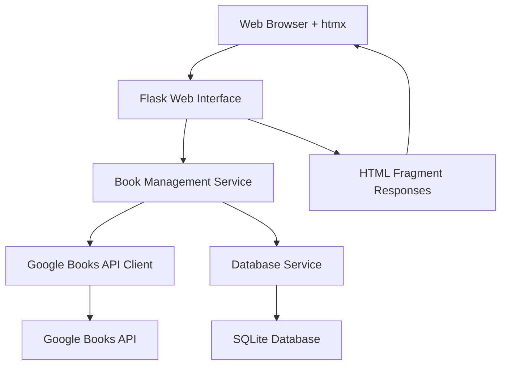

# Design Document: Book Management Application

## Overview

The Book Management Application is a web-based system that allows users to maintain a digital catalog of their purchased books by inputting ISBN numbers and automatically retrieving book metadata from the Google Books API. The application will be built using Python with Flask as the web framework and htmx for dynamic frontend interactions, providing a clean interface for book collection management with modern UX without complex JavaScript.

## Architecture

The application follows a three-tier architecture with htmx-enhanced frontend:

1. **Presentation Layer**: Flask web interface with htmx for dynamic interactions
2. **Business Logic Layer**: Book management services and Google Books API integration
3. **Data Layer**: SQLite database for persistent book storage



## Components and Interfaces

### Web Interface Component
- **Purpose**: Handle HTTP requests, render templates, manage user sessions
- **Technology**: Flask with Jinja2 templates, htmx integration, and responsive CSS
- **Key Features**:
  - htmx-powered form handling for ISBN input without page reloads
  - Dynamic book collection display with htmx navigation
  - Book detail view with htmx-enhanced interactions
  - Responsive layout adapting to desktop, tablet, and mobile screens
  - Touch-friendly interface elements for mobile devices
  - HTML fragment responses for htmx requests
  - Progressive enhancement ensuring functionality without JavaScript
  - Error message display with htmx updates

### Book Management Service
- **Purpose**: Core business logic for book operations
- **Responsibilities**:
  - ISBN validation (both ISBN-10 and ISBN-13)
  - Duplicate detection
  - Book data processing and storage
  - Collection retrieval and formatting

### Google Books API Client
- **Purpose**: Interface with Google Books API for book metadata retrieval
- **Implementation**: Python requests library with error handling
- **Key Features**:
  - ISBN-based book lookup
  - Rate limiting and retry logic
  - Response parsing and data extraction
  - Graceful error handling for API failures

### Database Service
- **Purpose**: Persistent storage of book collection
- **Technology**: SQLite with SQLAlchemy ORM
- **Schema**:
  ```sql
  CREATE TABLE books (
      id INTEGER PRIMARY KEY AUTOINCREMENT,
      isbn VARCHAR(13) UNIQUE NOT NULL,
      title VARCHAR(255),
      authors TEXT,
      publisher VARCHAR(255),
      published_date DATE,
      description TEXT,
      thumbnail_url TEXT,
      cover_image_url TEXT,
      created_at TIMESTAMP DEFAULT CURRENT_TIMESTAMP,
      updated_at TIMESTAMP DEFAULT CURRENT_TIMESTAMP
  );
  ```

## Data Models

### Book Model
```python
class Book:
    id: int
    isbn: str  # Normalized to ISBN-13 format
    title: str
    authors: List[str]  # Stored as JSON array
    publisher: str
    published_date: Optional[date]  # DATE type
    description: Optional[str]
    thumbnail_url: Optional[str]  # TEXT type for long URLs
    cover_image_url: Optional[str]  # TEXT type for long URLs
    created_at: datetime
    updated_at: datetime
```

### API Response Model
```python
class GoogleBooksResponse:
    total_items: int
    items: List[BookItem]

class BookItem:
    volume_info: VolumeInfo
    
class VolumeInfo:
    title: str
    authors: List[str]
    publisher: str
    published_date: Optional[str]  # Will be parsed to DATE
    description: Optional[str]
    image_links: Optional[ImageLinks]

class ImageLinks:
    thumbnail: str
    small: Optional[str]
    medium: Optional[str]
    large: Optional[str]
```

## Correctness Properties

*A property is a characteristic or behavior that should hold true across all valid executions of a system-essentially, a formal statement about what the system should do. Properties serve as the bridge between human-readable specifications and machine-verifiable correctness guarantees.*
### Property 1: ISBN Validation and Format Support
*For any* valid ISBN-10 or ISBN-13 number, the system should accept and normalize it for storage, ensuring both formats are supported consistently.
**Validates: Requirements 1.1, 1.4**

### Property 2: Invalid ISBN Rejection
*For any* invalid ISBN format or malformed input, the system should reject the input and display an appropriate error message.
**Validates: Requirements 1.2**

### Property 3: Data Persistence
*For any* valid ISBN submission, the book information should be immediately persisted to storage and be retrievable afterwards.
**Validates: Requirements 1.3**

### Property 4: Duplicate Prevention
*For any* ISBN that already exists in the collection, attempting to add it again should be rejected with a notification to the user.
**Validates: Requirements 1.5**

### Property 5: API Integration and Data Extraction
*For any* valid ISBN, submitting it should trigger a Google Books API query and extract all available book metadata (title, authors, publisher, thumbnail).
**Validates: Requirements 2.1, 2.2**

### Property 6: API Error Handling
*For any* Google Books API failure or error response, the system should return an appropriate error message without crashing.
**Validates: Requirements 2.3**

### Property 7: Incomplete Data Handling
*For any* API response with missing or incomplete book data, the system should store available information and handle missing fields gracefully.
**Validates: Requirements 2.4**

### Property 8: Book Collection Display
*For any* collection of stored books, the web interface should display all books with their title, author, publisher, and thumbnail (or placeholder).
**Validates: Requirements 3.1, 3.2**

### Property 9: Thumbnail Placeholder
*For any* book without a thumbnail URL, the display should show a placeholder image instead of broken or missing images.
**Validates: Requirements 3.3**

### Property 10: Character Encoding Support
*For any* book data containing international characters, the system should store, retrieve, and display the characters correctly without corruption.
**Validates: Requirements 4.1, 4.2, 4.3**

### Property 11: Mixed Language Text Support
*For any* book information containing mixed language text, the system should handle and display the content properly.
**Validates: Requirements 4.4**

### Property 12: System Error Resilience
*For any* system error or exception, the application should log the error and display a user-friendly message while maintaining stability.
**Validates: Requirements 5.4**

### Property 13: Form Submission Handling
*For any* valid form submission through the web interface, the system should process the input correctly and provide appropriate feedback.
**Validates: Requirements 6.4**

### Property 14: Book Detail Navigation
*For any* book in the collection, clicking on its title should navigate to a detailed view showing comprehensive book information.
**Validates: Requirements 3.6, 7.1**

### Property 15: Comprehensive Detail Display
*For any* book in the detail view, all available information (title, authors, publisher, publication date, description, cover image) should be displayed.
**Validates: Requirements 7.2**

### Property 17: Incomplete Detail Data Handling
*For any* book with missing information, the detail view should display available fields and appropriately indicate missing information.
**Validates: Requirements 7.3**

### Property 18: Detail View Navigation
*For any* book detail view, there should be a functional way to return to the main collection list.
**Validates: Requirements 7.4**

### Property 19: Detail View Cover Placeholder
*For any* book without a cover image, the detail view should display an appropriate placeholder image.
**Validates: Requirements 7.5**

### Property 20: HTMX AJAX Interactions
*For any* form submission or interface interaction, the system should use htmx AJAX requests instead of full page reloads.
**Validates: Requirements 8.2**

### Property 21: HTML Fragment Responses
*For any* htmx request, the server should return appropriate HTML fragments rather than full page responses.
**Validates: Requirements 8.3**

### Property 22: HTMX Navigation
*For any* navigation between book collection and detail views, htmx should be used for smooth content updates without page reloads.
**Validates: Requirements 8.4**

### Property 23: Progressive Enhancement
*For any* core functionality, the application should work correctly even when JavaScript is disabled.
**Validates: Requirements 8.5**

### Property 24: Desktop Layout Display
*For any* desktop screen size (1024px and wider), the application should display properly with appropriate layout and spacing.
**Validates: Requirements 9.1**

### Property 25: Tablet Layout Adaptation
*For any* tablet screen size (768px to 1023px), the application should adapt its layout appropriately for the viewport.
**Validates: Requirements 9.2**

### Property 26: Mobile Layout Optimization
*For any* mobile screen size (767px and smaller), the application should provide an optimized layout for the smaller viewport.
**Validates: Requirements 9.3**

### Property 27: Responsive Layout Adjustment
*For any* screen size change, the book collection display should adjust its layout accordingly to maintain usability.
**Validates: Requirements 9.4**

### Property 28: Mobile Detail View Stacking
*For any* book detail view on mobile devices, information should be stacked vertically for better readability.
**Validates: Requirements 9.5**

### Property 29: Touch Interface Sizing
*For any* interactive element on mobile devices, the element should be appropriately sized for touch interfaces (minimum 44px touch targets).
**Validates: Requirements 9.6**

## Error Handling

The application implements comprehensive error handling at multiple levels:

### Input Validation Errors
- Invalid ISBN format detection using checksum validation
- Empty or malformed input rejection
- Duplicate ISBN prevention with user notification

### External Service Errors
- Google Books API unavailability (network timeouts, service down)
- API rate limiting with exponential backoff retry
- Invalid API responses or missing data handling
- Network connectivity issues

### System Errors
- Database connection failures
- File system errors
- Unexpected exceptions with graceful degradation

### Error Response Strategy
- All errors displayed with clear, actionable messages
- Error logging for debugging and monitoring
- Graceful fallbacks (e.g., placeholder images for missing thumbnails)
- System stability maintained even during external service failures

## Testing Strategy

The application will use a dual testing approach combining unit tests and property-based tests for comprehensive coverage.

### Unit Testing
- **Framework**: pytest for Python testing
- **Focus Areas**:
  - Specific ISBN validation examples (valid/invalid cases)
  - API response parsing with known data
  - Database operations with test data
  - Error handling with simulated failures
  - International character processing with sample strings

### Property-Based Testing
- **Framework**: Hypothesis for Python property-based testing
- **Configuration**: Minimum 100 iterations per property test
- **Focus Areas**:
  - ISBN validation across all possible valid/invalid inputs
  - API integration with generated test data
  - Data persistence and retrieval consistency
  - International character handling with random Unicode strings
  - Error handling with various failure scenarios

### Test Organization
- Unit tests co-located with source files using `_test.py` suffix
- Property tests tagged with comments referencing design properties
- Integration tests for end-to-end workflows
- Mock external services (Google Books API) for reliable testing

### Property Test Tagging
Each property-based test will include a comment with the format:
**Feature: book-management, Property {number}: {property_text}**

This ensures traceability between design properties and test implementations, enabling verification that all correctness properties are properly validated through automated testing.